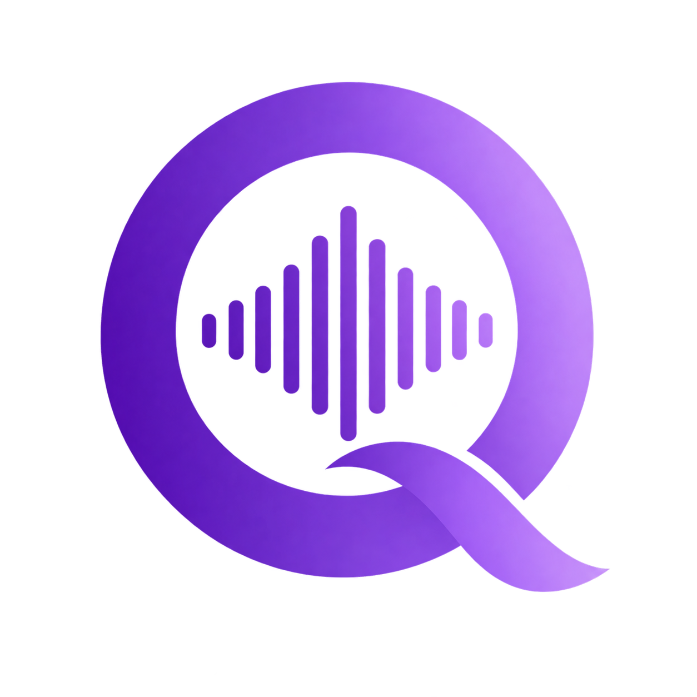

<p align="center"></p>

# Quix8D

Quix8D is a macOS menu bar app that turns whatever your Mac is playing
(Spotify, YouTube, games, anything) into live **8D audio**: the sound
circles around your head. It also has per-app volume, a spatial map to
place apps around you, a master EQ with a live spectrum analyzer, and six
effects.

Use headphones. The effect is built for them.

## Download and install

1. Download **Quix8D-x.y.dmg** from the
   [latest release](https://github.com/Quix28/Quix8D/releases/latest).
2. Open the DMG and drag **Quix8D** onto **Applications**.
3. Open Quix8D from Applications. The app isn't notarized by Apple, so
   the first launch is blocked with "Apple could not verify…". To allow it:
   - Open **System Settings → Privacy & Security**, scroll down and click
     **Open Anyway** next to the Quix8D message, then confirm.
   - Or run this once in Terminal:
     `xattr -dr com.apple.quarantine /Applications/Quix8D.app`
4. A **Q** icon appears in the menu bar. There is no Dock icon.
5. Click it and switch **8D Audio** on. macOS asks for permission to
   capture system audio. Click **Allow**. If you missed the prompt, turn
   it on in **System Settings → Privacy & Security → Audio Recording**.

**Requirements:** macOS 14.4 (Sonoma) or later on an Apple silicon Mac.

To uninstall, quit Quix8D (power button in the panel) and move it from
Applications to the Trash.

## How it works

```
apps playing sound ──► per-app capture ──► 8D rotation ──► effects ──► EQ ──► pan/boost ──► your output
                       (Core Audio taps)   (Apple HRTF)
```

1. **Capture.** Quix8D uses Core Audio process taps to take the sound of
   each app that is playing, one tap per app. The original sound is muted
   so you only hear the processed version.
2. **8D rotation.** Apple's HRTF spatial mixer (the engine behind Spatial
   Audio) moves the sound around your head. Apps you place on the map
   stay put while everything else rotates. With AirPods that support head
   tracking, sounds stay fixed in the room as you turn your head. If the
   HRTF mixer is unavailable, Quix8D falls back to its own binaural
   filters.
3. **Effects and EQ.** Optional reverb, compressor, delay, widener, bass
   enhancer and chorus, then an 8-band EQ with high- and low-pass filters.
4. **Output.** Pan and the 6× boost come last, then the audio plays
   through the output device you picked.

Everything runs locally on your Mac. Nothing is recorded or sent anywhere.
Audio capture only runs while a feature needs it. The macOS recording
indicator in the menu bar shows when it is on.

## Using the app

Click the **Q** in the menu bar to open the panel.

**Main page**

- **8D Audio** switch (under the Rotation knob): turns the 8D effect on
  or off.
- **Rotation** knob: left spins anticlockwise, right spins clockwise,
  middle stops. Up to one turn every 2 seconds. Double-click to stop.
- **Volume** knob: your Mac's output volume.
- **1× / 6×** button: extra gain on top of the Mac's volume,
  soft-limited so it doesn't clip. Mind your ears.
- **Pan** knob: left/right balance. Double-click to centre.
- **App faders:** a volume fader for each app playing sound.
  Double-click a fader to reset it to 100%.
- **Effects** switch (top right): off bypasses everything and plays audio
  straight through.
- **Power** button (top right): quits Quix8D.
- **Output device** (bottom): pick where the sound goes.

**Mix page**

- **Map:** click an app under **Not placed** to put it in front of you,
  then drag it anywhere around your head. Closer is louder. Double-click
  it to take it off the map. Positions are remembered.
- **EQ:** drag a dot to set frequency and gain, scroll over it to change
  Q, double-click to reset it. Drag **HPF**/**LPF** sideways to set the
  cutoff, click to switch them on or off. **Flat** resets the EQ.
  **Presets** saves and loads your EQ settings.
- **RTA:** live spectrum of what's playing, with the peak and the level
  under the cursor.

**Effects page:** six effects, each with its own switch and sliders.

## Known limitations

- Rotation is horizontal only, with no height movement.
- It's a live effect only. There's no recording or export.
- When a new app starts playing, you may hear a short blip (about
  0.1–0.2 s) while Quix8D adds it. It checks for new apps every 1.5 s.

## Troubleshooting

- **No sound change / stuck on "Starting…":** check **System Settings →
  Privacy & Security → Audio Recording** and make sure Quix8D is allowed.
  Then quit and reopen it.
- **"Quix8D is damaged and can't be opened":** that's the quarantine flag
  on an unnotarized app. Run the `xattr` command from step 3 above.
- **An app is missing from the faders:** it only shows up while it is
  actually playing sound.

## Build from source

Needs Xcode 15.3 or later, or its command line tools.

```sh
./Scripts/build_app_bundle.sh   # builds build/Quix8D.app
./Scripts/make_dmg.sh           # builds build/Quix8D-<version>.dmg
swift test                      # runs the tests
```

The build script signs with your "Apple Development" identity if you have
one, otherwise ad-hoc. With ad-hoc signing macOS forgets the audio
permission after every rebuild. If the project is inside an
iCloud-synced Desktop or Documents folder, run `swift build`/`swift test`
with `--scratch-path` pointing outside it, or codesign fails.

To publish a release, bump `CFBundleShortVersionString` in
`Resources/Info.plist`, run `make_dmg.sh`, and attach the DMG to a GitHub
release.

### Project layout

```
Sources/Quix8D/
  App/     app entry, menu bar controller, OS checks
  Audio/   capture, render pipeline, HRTF, effects, EQ, analyzer
  UI/      SwiftUI panel, EQ graph, effects page, spatial map
Tests/Quix8DTests/   unit tests and an opt-in render benchmark
Resources/           Info.plist, app icon, menu bar icon, logo
Scripts/             build and DMG packaging
```
